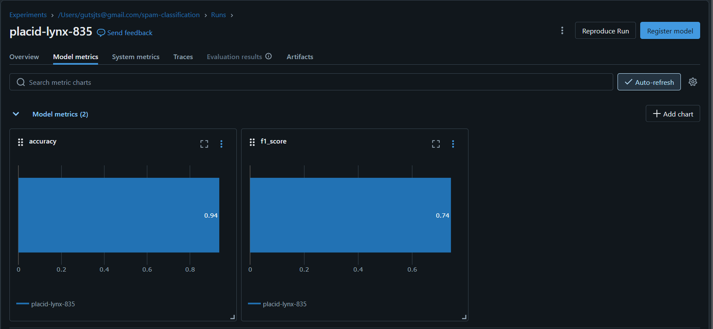
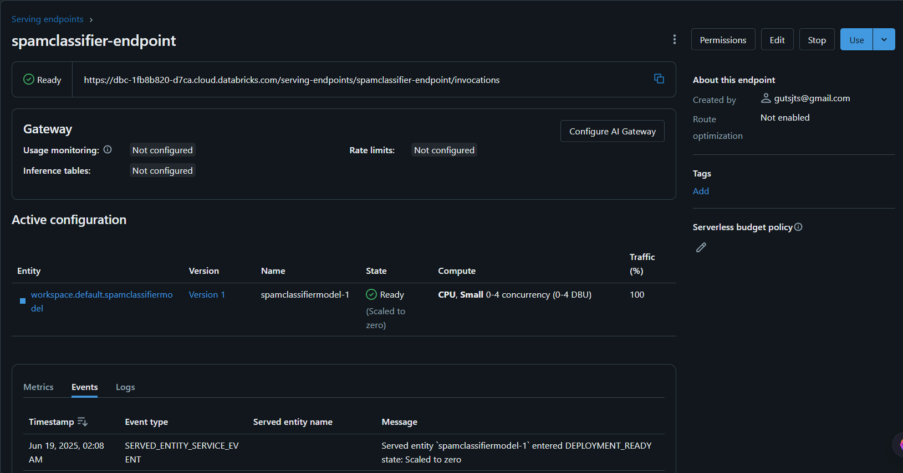

# 📧 Spam Classification with MLOps on Databricks

This project demonstrates an **end-to-end MLOps workflow** for binary text classification (spam detection) using:

- ✅ PyTorch for model training  
- ✅ TF-IDF for text vectorization  
- ✅ MLflow for experiment tracking, model registry, and serving  
- ✅ Databricks as the unified ML platform  

It’s designed to replicate production-ready workflows — including deployment and inference using a REST API.

---

## 📦 Dataset

- Source: [Hugging Face - SMS Spam](https://huggingface.co/datasets/sms_spam)
- Task: Classify each SMS/email as **spam** (1) or **not spam** (0)

---

## ✅ Workflow Overview

### 🔢 Step 1: Data Loading & Preprocessing
- Load from HuggingFace
- TF-IDF vectorization (`scikit-learn`)

### 🧠 Step 2: Model Training
- PyTorch binary classifier (1 hidden layer)
- Trained with `BCEWithLogitsLoss` and `Adam`

### 📊 Step 3–5: MLflow Tracking
- Log params (epochs, LR), metrics (accuracy, F1), and artifacts


> MLflow experiment inside Databricks showing run ID, logged metrics, and parameters

### 📦 Step 6: Model Registration & Serving
- Registered to MLflow Model Registry
- Enabled **real-time serving** on Databricks


> Model deployed using Databricks Serving — ready to accept REST API requests

### 🌐 Step 7: Inference Pipeline (API)

```python
import requests, json

input_email = ["Congratulations! You’ve won a free iPhone. Click here to claim now."]
input_vec = vectorizer.transform(input_email).toarray().tolist()

headers = {
    "Authorization": f"Bearer <DATABRICKS_TOKEN>",
    "Content-Type": "application/json"
}

data = {"inputs": input_vec}
res = requests.post("<YOUR_MODEL_ENDPOINT>", headers=headers, data=json.dumps(data))

label = 1 if res.json()["predictions"][0][0] > 0.5 else 0
print("Prediction:", "Spam" if label else "Not Spam")
```

## 🚀 Optional MLOps Extensions

| Task                                                   | Status   |
|--------------------------------------------------------|----------|
| 🧠 Bundle vectorizer + model with `mlflow.pyfunc`      | 🔄 Planned |
| 📉 Simulate model drift & trigger retraining           | 🔄 Planned |
| 🕒 Automate weekly retraining with Databricks Jobs     | 🔄 Planned |

## 🛠️ Tech Stack

- Python, PyTorch, Scikit-learn  
- MLflow, Databricks (Free Edition)  
- HuggingFace Datasets  
- Requests (for API calling)

## 👨‍💻 Author

**Veeresh Pattanad**  
AI/ML Undergraudate | Data Engineer Intern  
🔗 [GitHub](https://github.com/veereshpattanad)


